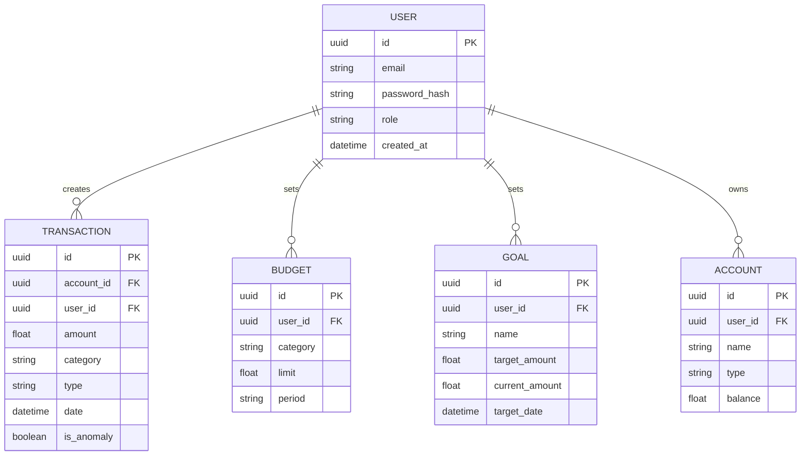

# Database Entity Relationship Diagram

```mermaid
erDiagram
    USER ||--o{ TRANSACTION : creates
    USER ||--o{ BUDGET : sets
    USER ||--o{ GOAL : sets
    USER ||--o{ ACCOUNT : owns
    
    USER {
        uuid id PK
        string email
        string password_hash
        string role
        datetime created_at
    }
    
    ACCOUNT {
        uuid id PK
        uuid user_id FK
        string name
        string type
        float balance
    }
    
    TRANSACTION {
        uuid id PK
        uuid account_id FK
        uuid user_id FK
        float amount
        string category
        string type
        datetime date
        boolean is_anomaly
    }
    
    BUDGET {
        uuid id PK
        uuid user_id FK
        string category
        float limit
        string period
    }
    
    GOAL {
        uuid id PK
        uuid user_id FK
        string name
        float target_amount
        float current_amount
        datetime target_date
    }
```
